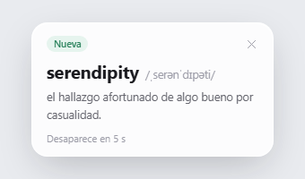
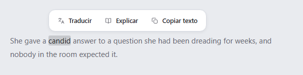
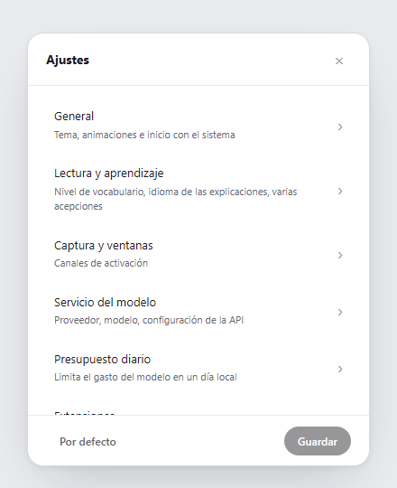
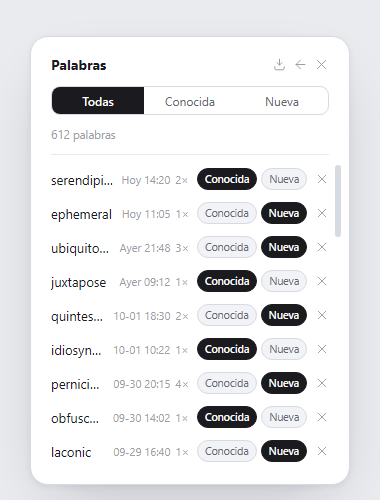

# Lens

**Sigue leyendo sin cambiar de ventana.** Lens es una aplicación de aprendizaje de inglés para la bandeja del sistema de Windows. Muestra explicaciones de palabras, nombres y frases en pequeñas ventanas flotantes, sin abrir un diccionario aparte.

[English](README.md) · [简体中文](README.zh-CN.md) · [日本語](README.ja.md) · [Español](README.es.md)

## Pensado para leer

Selecciona texto para consultar una explicación y marca las palabras como conocidas o nuevas antes de seguir leyendo. Si el texto no se puede seleccionar, puedes delimitar una zona de la pantalla para aplicar OCR. El escaneo automático es opcional y solo funciona en las aplicaciones que permitas.

Lens clasifica el texto capturado en tu PC como palabra, entidad o frase. Para una palabra envía la palabra; para una entidad, su nombre; para una frase, el texto seleccionado. Antes de enviarlo, oculta las URL, las direcciones de correo y las secuencias largas de dígitos. La explicación la devuelve el proveedor de IA que elijas. Lens no incluye un diccionario local de definiciones.

Usa tu propia clave de API con un proveedor compatible o un endpoint HTTPS personalizado. Puedes elegir el idioma de las explicaciones, consultar definiciones guardadas, marcar palabras conocidas o nuevas y revisar el historial y el coste de los modelos. Un límite diario puede pausar las solicitudes cuando se alcanza.

## Criterios de diseño

- **No interrumpir la lectura.** Lens permanece en la bandeja y muestra cada explicación junto al texto que la originó.
- **Enviar solo el contenido necesario.** La selección de candidatos y la clasificación del texto se hacen en el PC; el proveedor elegido genera la explicación.
- **Dejar los límites en manos del lector.** Elige cómo capturar texto, qué aplicaciones puede revisar el escaneo automático, qué proveedor usar y cuánto gastar al día.
- **Guardar el progreso en el PC del lector.** La configuración, la clave de API, la caché de explicaciones, las marcas y el historial se guardan en el perfil de usuario de Windows.

## Diseños de interfaz

Estas imágenes son capturas de los archivos HTML de [`ui-prototypes/`](ui-prototypes/). Muestran propuestas de diseño, no la aplicación en ejecución; la implementación puede ser distinta.

| Burbuja de explicación | Acciones de selección |
| --- | --- |
|  |  |

| Ajustes | Historial de palabras |
| --- | --- |
|  |  |

## Idiomas y apariencia

La interfaz y las explicaciones generadas están disponibles en inglés, chino, español y japonés. La interfaz ofrece los temas Light, Dark, Forest y Custom, además de un control de animaciones que respeta la configuración de accesibilidad de Windows.

## Privacidad y seguridad

La clave de API y los datos de aprendizaje se guardan en `%APPDATA%\Lens\settings.json`. Lens envía el texto capturado al proveedor que configures; evita enviar información confidencial o sensible. La protección de datos solo cubre algunos patrones y no detecta toda la información personal. Consulta [SECURITY.md](SECURITY.md) para conocer los flujos de datos, las medidas actuales, sus límites y cómo informar de un problema de seguridad.
