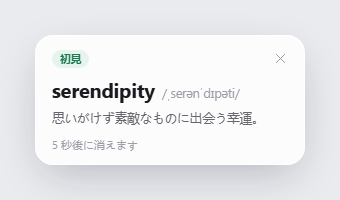
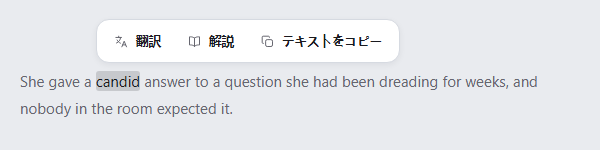
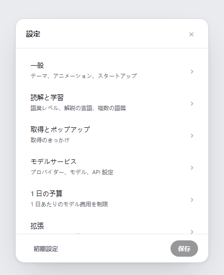
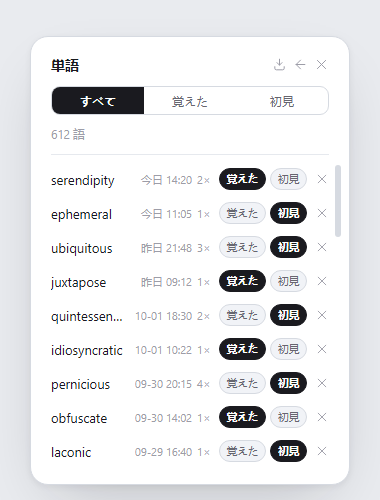

# Lens

**読んでいるページから離れずに、英語を調べる。** Lens は Windows のタスクトレイに常駐し、単語、固有名詞、文の説明を小さなオーバーレイで表示する学習ツールです。別の辞書ウィンドウを開く必要はありません。

[English](README.md) · [简体中文](README.zh-CN.md) · [日本語](README.ja.md) · [Español](README.es.md)

## 読書の流れに合わせて

テキストを選択すると説明を表示できます。単語には「覚えた」「新しい」の印を付け、そのまま読書を続けられます。選択できない文字は、画面の範囲を指定して OCR にかけます。自動スキャンは任意で、許可したアプリだけを対象にします。

取得したテキストは PC 上で単語、固有名詞、文のリクエストに分類します。単語のリクエストでは単語を、固有名詞では名前を、文では選択した文を送信します。送信前に URL、メールアドレス、長い数字列をマスクします。説明は選択した AI サービスから返されます。Lens にローカルの定義辞書は含まれていません。

自分の API キーを使い、対応サービスまたは独自の HTTPS エンドポイントに接続できます。説明の言語、単語説明のキャッシュ、学習済みの印、単語履歴、モデルの費用も管理できます。1 日の予算に達したときはリクエストを一時停止できます。

## 設計の考え方

- **読書を中断させない。** Lens はタスクトレイに常駐し、説明を元のテキストのそばに表示します。
- **必要な内容だけを送る。** 候補の選別とテキストの分類は PC 上で行い、説明は選択したサービスに任せます。
- **使い方の境界は読者が決める。** 取得方法、自動スキャンを許可するアプリ、サービス、1 日の予算を選べます。
- **学習記録は自分の PC に保存する。** 設定、API キー、説明キャッシュ、単語の印、履歴は Windows のユーザープロファイルに保存されます。

## UI のデザイン案

以下は [`ui-prototypes/`](ui-prototypes/) の HTML から撮影したデザイン案です。実行中のアプリのスクリーンショットではなく、実装と異なる場合があります。

| 説明バブル | 選択アクションバー |
| --- | --- |
|  |  |

| 設定 | 単語履歴 |
| --- | --- |
|  |  |

## 言語と外観

UI と生成される説明は英語、中国語、スペイン語、日本語に対応しています。Light、Dark、Forest、Custom のテーマを選べます。アニメーション設定は Windows のアクセシビリティ設定に従います。

## プライバシーとセキュリティ

API キーと学習データは `%APPDATA%\Lens\settings.json` に保存されます。取得したテキストは設定したサービスに送信されるため、機密情報や慎重に扱うべき内容は送信しないでください。マスキングで検出できる情報には限りがあります。データの流れ、現在の対策、既知の制限、脆弱性の報告方法は [SECURITY.md](SECURITY.md) をご覧ください。
