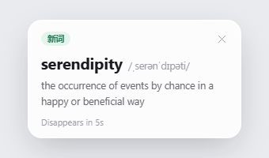
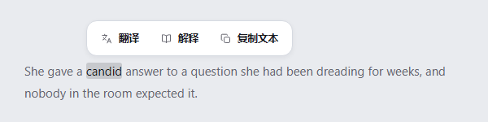
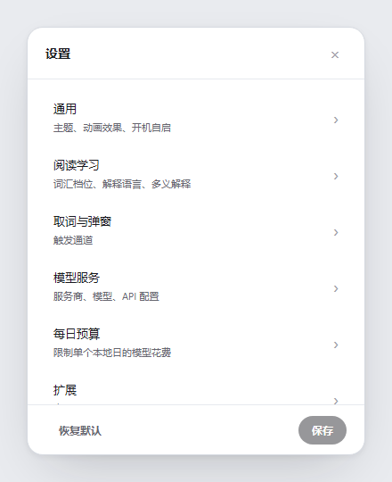
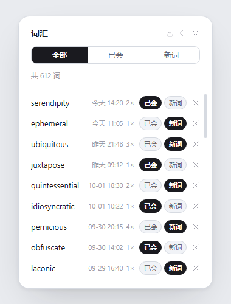

# Lens

**读英文时，不必离开正在看的页面。**Lens 是一款常驻 Windows 系统托盘的英语学习工具，会在文字旁显示单词、名称和句子的解释，不必另开词典窗口。

[English](README.md) · [简体中文](README.zh-CN.md) · [日本語](README.ja.md) · [Español](README.es.md)

## 为阅读而做

选中一段文字即可查看解释，也可以把单词标记为 “已会” 或 “新词”，然后继续阅读。文字无法选中时，可以框选屏幕区域进行 OCR。自动扫描是可选功能，只会在你允许的应用中运行。

Lens 在本机把捕获的文字分成单词、实体名称或句子请求。查单词时发送单词，查实体时发送名称，处理句子时发送选中的句子。发送前会遮盖 URL、电子邮件地址和较长的数字串。解释由你选择的 AI 服务商返回；Lens 不内置释义词典。

你可以使用自己的 API key，连接支持的服务商或自定义 HTTPS 端点。还可以选择解释语言、查看已缓存的释义、记录已会与新词，并查看词汇历史和模型费用。达到每日预算后，Lens 可以暂停请求。

## 产品理念

- **不打断阅读。**Lens 常驻托盘，解释贴近触发它的文字显示。
- **只发送必要内容。**候选筛选和文本分类在本机完成，解释交给你选择的服务商。
- **由读者决定边界。**你可以选择取词方式、自动扫描可查看的应用、模型服务商和每日花费上限。
- **学习记录留在自己的电脑上。**设置、API key、释义缓存、词汇标记和历史保存在当前 Windows 用户配置文件中。

## 界面设计稿

下图由 [`ui-prototypes/`](ui-prototypes/) 中的 HTML 页面截取，仅展示界面设计稿，并非运行中应用的截图；实际实现可能有所不同。

| 解释气泡 | 选区动作条 |
| --- | --- |
|  |  |

| 设置 | 词汇历史 |
| --- | --- |
|  |  |

## 语言与外观

界面和生成的解释支持英语、中文、西班牙语和日语。界面提供 Light、Dark、Forest 和 Custom 主题，以及遵循 Windows 辅助功能设置的动画开关。

## 隐私与安全

API key 和学习数据保存在 `%APPDATA%\Lens\settings.json`。Lens 会把捕获的文字发送给你配置的服务商，请勿发送机密或敏感内容。当前脱敏范围有限，不能识别所有类型的个人信息。数据流、现有保护措施、已知限制和安全问题报告方式见 [SECURITY.md](SECURITY.md)。
